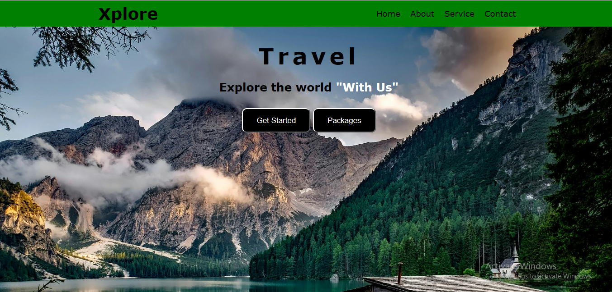

# Project README

This project was given by Prodigy Infotech as Task 1 in the domain Web Development.

## Description

This project is an HTML Responsive Travel Agency Landing Page. When we minimize the website in mobile view the dropdown menu will appear which consists of the home,about,services and contact. 

Languages used: HTML, CSS, JavaScript

Website Link:https://xploreagency.netlify.app/

  

## File Structure

- `index.html`: The main HTML file for the webpage.
- `styles.css`: Directory containing CSS stylesheets.
- `assets.jpg`: Directory containing images used in the webpage.
- `screenshot1.png`: The result of the task 1.
